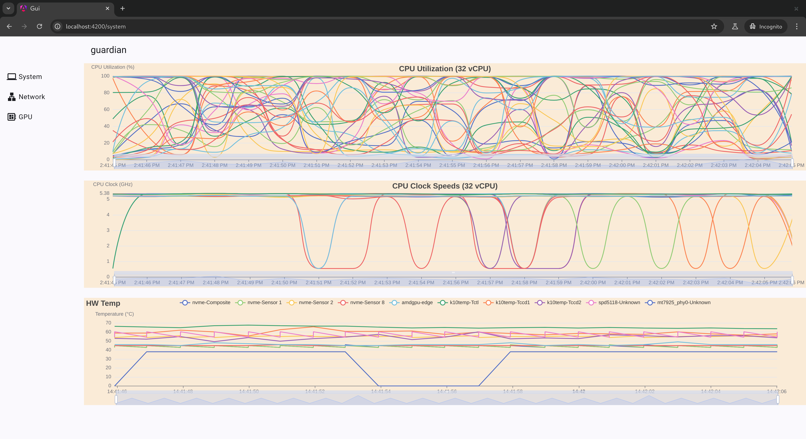
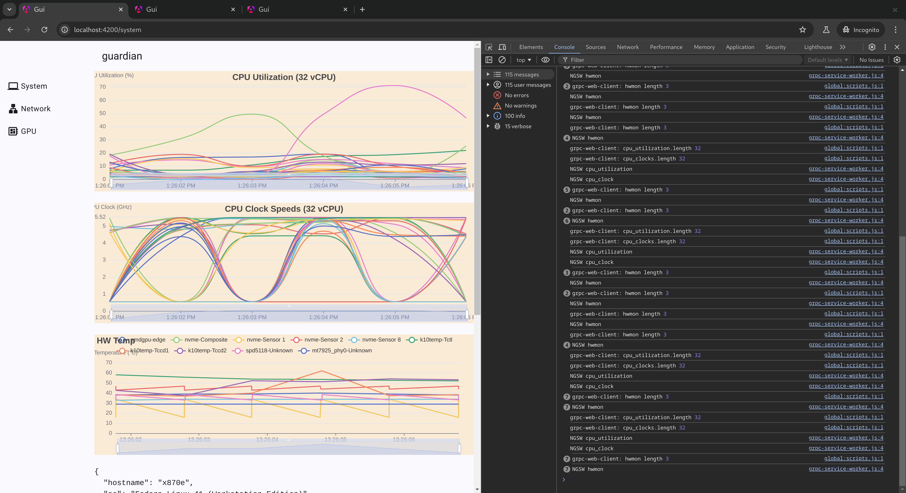
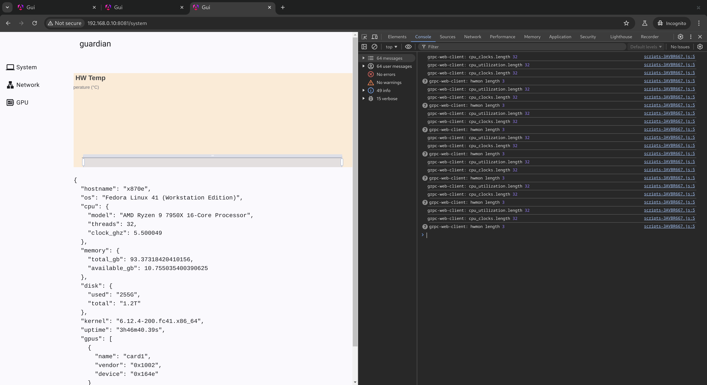

# guardian: a (toy) tool for monitoring Linux system

## metrics
- system info, cpu usage, hardware temperature: kinda functional
- network especially wireguard (that's how the guardian name came to mind): in-progress
- gpu metrics: in-progress amdgpu
- terminal-ui: in-roadmap



## stack
- grpc-web with Envoy gateway
- gRPC server in golang
- Angular web UI with (ngx-)echarts

The tech may be rather complicated for the value it delivers. Charts in Angular UI works only with `ng serve` and on localhost address only. Host addresses other than localhost doesn't work. Built UI doesn't work even with localhost.

Built UI (including grpc client) served with go server does connect to the grpc server, and logs received data. Apparently service worker doing not getting the events; `console.log("NGSW", type)` in [grpc-service-worker.js](./gui/public/grpc-service-worker.js) doesn't get executed in prod/non-localhost (right screenshot)

|                                            |                                              |
|--------------------------------------------|----------------------------------------------|
|  |  |

## develop

### prereqs
- node
- golang
- envoy

```sh
go mod tidy
go run .
```

Or first [build the web-ui](./gui/README.md) and serve dist from local filesystem

```sh
go run . -dir gui/dist/gui/browser -spa
```

Or embed the built UI assets, allowing it to be distributed as a single binary 

```sh
go build -o guardian .
./guardian -dir gui/dist/gui/browser -spa -embed
```

### regenerate proto stubs if modified
```sh
## go
protoc -I=./proto ./proto/metrics.proto --go_out=. --go-grpc_out=.
```
